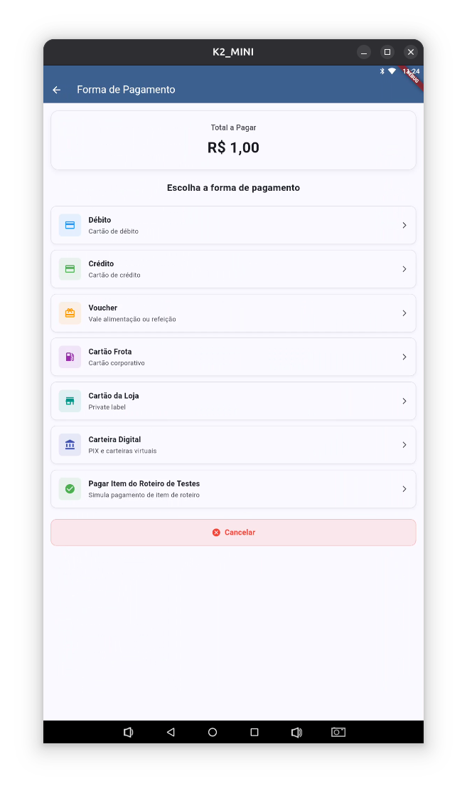

# 🏦 Demo Tef PayGo Simples

<p align="center">
   
</p>

<p align="center">
   <strong>Demonstração de integração com PayGo TEF para Flutter</strong>
</p>

<p align="center">
   <a href="#tecnologias-utilizadas">🚀 Tecnologias</a> •
   <a href="#pré-requisitos">📋 Pré-requisitos</a> •
   <a href="#executando-o-projeto">⚡ Executar</a> •
   <a href="#arquitetura">🏗️ Arquitetura</a>
</p>

---

## 📋 Sobre o Projeto

O **DemoTefPayGoSimples** é um projeto de exemplo que demonstra a integração completa com o sistema PayGo TEF (Transferência Eletrônica de Fundos) em aplicações Flutter. Este projeto serve como referência para desenvolvedores que desejam implementar pagamentos via TEF em seus aplicativos.

### 📊 Status do Projeto

<p align="center">
   
   
   
   
   
   
   
   
</p>

### ✨ Funcionalidades

- 💳 Processamento de pagamentos via TEF
- 🖨️ Impressão de comprovantes
- ⚙️ Configuração de pin-pad (USB/Bluetooth)
- 🔧 Instalação e manutenção do PayGo Integrado
- 🎯 Interface intuitiva e responsiva
- 🎨 **Material 3** - Design system moderno do Flutter

---

## 🚀 Tecnologias Utilizadas

| Tecnologia | Descrição | Link |
|------------|-----------|------|
| **PayGo SDK** | SDK para integração com PayGo | [GitHub](https://github.com/claudneysessa/paygo_sdk) |
| **PayGo Integrado** | Sistema de pagamento integrado oficial | [Documentação](https://paygodev.readme.io/docs/o-paygo-integrado) |
| **Flutter** | Framework de desenvolvimento multiplataforma | [Flutter.dev](https://flutter.dev) |
| **Material 3** | Design system moderno do Flutter | [Documentação](https://m3.material.io/) |

---

## 📋 Pré-requisitos

### 🔑 Credenciais PayGo Integrado

1. **Obter credenciais** - Entre em contato com o suporte da PayGo
2. **Download do SDK** - Baixe o [PayGo Integrado e PayGo SDK](https://www.setis.com.br/filevista/public/5ky5/kit-paygo-android-v4-1-50-5.zip) ⚠️

### 📱 Instalação no Dispositivo

#### 1. Instalar PayGo Integrado
```bash
# Para Produção
PGIntegrado-v4.1.50.5_PROD-signed.apk

# Para Homologação  
PGIntegrado-v4.1.50.5_CERT-signed.apk
```

#### 2. Instalar Demo App
```bash
flutter install
```

### ⚙️ Configuração Inicial

#### Configurações do Pin-Pad
1. Acesse **Configurações** → **Pin-pad**
2. Digite a senha do lojista: `999999` (padrão)
3. Ative **Usar pin-pad**
4. Selecione o tipo: **USB** ou **Bluetooth**
5. **Teste o Pin-pad**

#### Instalação do Sistema
1. Clique em **"Instalação"**
2. Digite a senha técnica: `314159`
3. Configure os dados:
   - **ID do ponto de captura**
   - **CNPJ do usuário**
   - **Endereço do servidor**
   - **Porta do servidor**

> ⚠️ **Importante**: Baixe a versão correta (produção ou homologação) conforme sua necessidade.

---

## ⚡ Executando o Projeto

```bash
# Clone o repositório
git clone [url-do-repositorio]
cd demo_tefpaygo_simples

# Instale as dependências
flutter pub get

# Execute o projeto
flutter run
```

---

## 🏗️ Arquitetura

A arquitetura está documentada em detalhes no arquivo [arquitetura.md](docs/arquitetura.md).

### 📐 Estrutura em Camadas

```
┌─────────────────┐
│      View       │ ← Interface do usuário
├─────────────────┤
│   Controller    │ ← Regras de negócio
├─────────────────┤
│      Model      │ ← Dados e configurações
└─────────────────┘
```

### 🎮 Controllers

#### PayGoTefController
**Arquivo**: [`lib/controller/paygo_tefcontroller.dart`](lib/controller/paygo_tefcontroller.dart)

Responsável pelas regras de negócio e implementa a interface [`TefPayGoCallBack`](docs/arquitetura.md#tefpaygocallback).

**Funcionalidades**:
- ✅ Habilitar/Desabilitar impressão de comprovante
- 🔄 Trocar impressora ([Generic Printer](docs/arquitetura.md#generic-printer))
- 🎯 Gerenciamento de transações

### 🖥️ Views

#### Telas Principais

| Tela | Arquivo | Descrição |
|------|---------|-----------|
| **HomePage** | [`lib/view/screens/home_page.dart`](lib/view/screens/home_page.dart) | Tela principal com navegação |
| **PaymentPage** | [`lib/view/screens/payment_page.dart`](lib/view/screens/payment_page.dart) | Teclado numérico para valores |
| **ConfigPage** | [`lib/view/screens/config/config_page.dart`](lib/view/screens/config/config_page.dart) | Configurações do sistema |
| **PaymentMode** | [`lib/view/screens/payment/payment_mode.dart`](lib/view/screens/payment/payment_mode.dart) | Seleção do modo de pagamento |

#### Navegação
A aplicação utiliza `NavigationBar` (Material 3) para navegar entre as telas principais, oferecendo uma experiência de navegação moderna e intuitiva.

#### 🎨 Material 3
O projeto implementa o **Material 3**, o design system mais recente do Flutter, oferecendo:
- 🎯 **NavigationBar** - Navegação moderna e acessível
- 🎨 **ColorScheme** - Sistema de cores adaptativo
- 📱 **Responsividade** - Adaptação automática a diferentes tamanhos de tela
- 🌙 **Tema escuro** - Suporte completo ao modo escuro
- ♿ **Acessibilidade** - Melhor suporte a tecnologias assistivas

---

## 📱 Screenshots

<p align="center">
   
   
</p>

---

## 📁 Estrutura do Projeto

```
demo_tefpaygo_simples/
├── 📱 android/                 # Configurações Android
├── 📚 docs/                    # Documentação
├── 🎨 lib/                     # Código fonte
│   ├── 🎮 controller/          # Controllers
│   ├── ⚠️ exception/           # Tratamento de erros
│   ├── 🏠 main.dart            # Ponto de entrada
│   ├── 📊 model/               # Modelos de dados
│   ├── 🛠️ utils/               # Utilitários
│   └── 🖥️ view/                # Interface do usuário
├── 🖨️ prints/                  # Screenshots
└── 🧪 test/                    # Testes
```

---

## 🤝 Contribuição

1. Faça um Fork do projeto
2. Crie uma Branch para sua Feature (`git checkout -b feature/AmazingFeature`)
3. Commit suas mudanças (`git commit -m 'Add some AmazingFeature'`)
4. Push para a Branch (`git push origin feature/AmazingFeature`)
5. Abra um Pull Request

---

## 📄 Licença

Este projeto está sob a licença [MIT](LICENSE). Veja o arquivo `LICENSE` para mais detalhes.

---

## 📞 Suporte

- 🐛 **Issues**: [GitHub Issues](https://github.com/seu-usuario/demo_tefpaygo_simples/issues)
- 📖 **Documentação**: [docs/](docs/)

---

## 🙏 Créditos

### PayGo SDK
SDK desenvolvido por **Claudney Sarti Sessa** para integração com o **PayGO Integrado** via URI.

**Desenvolvedores**:
- [Claudney Sarti Sessa](https://github.com/claudneysessa) - Criador do PayGo SDK
- [Daniel Oliveira Souza](https://github.com/dosza) - Contribuidor

**Repositório**: [PayGo SDK](https://github.com/claudneysessa/paygo_sdk)

---

<p align="center">
   <strong>Desenvolvido com ❤️ para a comunidade Flutter</strong>
</p>