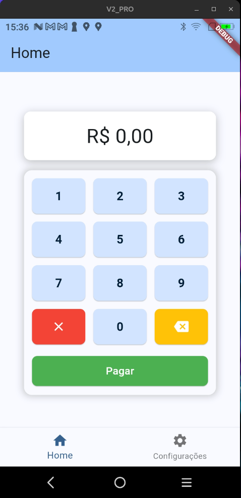

<p align="center">
   
</p>

# DemoTefPayGoSimples #
DemoTefPayGoSimples é um projeto de exemplo que demonstra a integração


Tecnologias utilizadas
---
+ [PayGo SDK](https://github.com/claudneysessa/paygo_sdk)
+ [PayGo Integrado](https://paygodev.readme.io/docs/o-paygo-integrado)

Getting Started
--- 
## Pré-requisitos do PayGo Integrador ##

1. Obter as crendenciais do PayGo Integrado (entre contato com o suporte da PayGo)
2. Baixar o [PayGo Integrado e PayGo SDK](https://setis.com.br/filevista/public/pg6b/kit-paygo-android-v4-1-35-7.zip)\*
3. Instalar o Apk do PayGo Integrado no dispositivo. 
   1. Para produção instalar o apk *PGIntegrado-v4.1.27.13_PROD-signed.apk*
   2. Para homologação instalar o apk *PGIntegrado-v4.1.27.13_CERT-signed.apk* 
4. Instalar este aplicativo no dispositivo. 
5. Ir em tela de configurações
6. Clicar no bõtão "Instalação" e digitar a senha técnica padrão  (314159)
   1. Digitar o id do ponto de captura 
   2. Digitar CPNJ do usuário 
   3. Digitar o endereço do servidor:

\* Lembre-se de baixar a versão correta para produção ou homologação

 ## Executando o projeto ##

```bash
flutter pub get
flutter run 
```

Arquitetura básica da aplicação
---
A arquitetura está especificada no arquivo [arquitetura.md](docs/arquitetura.md)

Em resumo é divida em três camadas:

+ Model
+ View
+ Controller

### Controller ###

#### PayGoTefController ####
[PayGoTefController](lib/controller/PayGoTefController.dart) é responsável pelas regras de negócio.<br/>

Essa classe implementa a interface [TefPayGoCallBack](docs/arquitetura.md#tefpaygocallback)

Contém propriedades configuráveis que permitem:
+   Habilitar/Desabilitar a impressão do comprovante
+   Trocar a [impressora](docs/arquitetura.md#generic-printer)

### View ###
Responsável por mostrar as informações para o usuário.

#### screens ####
Telas da aplicação

[MyHomePage](lib/view/screens/home_page.dart) é a tela principal da aplicação.<br/>
Essa tela implementa  [bottomNavigationBar](https://api.flutter.dev/flutter/material/BottomNavigationBar-class.html) para navegar entre as telas:
+  [PaymentPage](lib/view/screens/payment_page.dart)
+  [ConfigurationPage](lib/view/screens/config/config_page.dart)

[PaymentPage](lib/view/screens/payment_page.dart)<br/>
Tela que contém o teclado numérico para inserir o valor de pagamento.

[ConfigurationPage](lib/view/screens/config/config_page.dart)<br/>
Tela de configuração. Permite instalar, manutenção e configuração do PayGo Integrado.

[PaymentMode](lib/view/screens/payment/payment_mode.dart)<br/>
Tela que permite escolher o modo de pagamento.